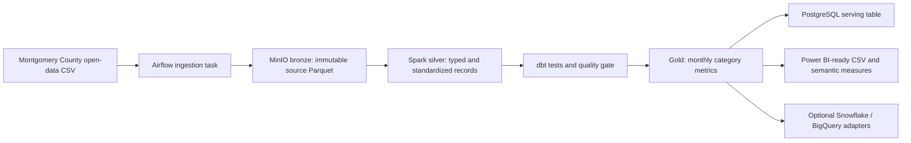

# Retail Lakehouse Architecture

## Decision record

This project uses the Montgomery County, Maryland **Warehouse and Retail Sales** open dataset rather than a customer-level retail dataset. The source is published monthly and contains sales and movement measures by supplier, item, and department. It supports an interview-ready retail analytics workflow without including customer identities or personal information. [1]

| Layer | Purpose | Local implementation | Cloud-compatible equivalent |
|---|---|---|---|
| Bronze | Immutable source capture with provenance | MinIO bucket / local Parquet contract | S3, GCS, or Azure Blob |
| Silver | Validated typed records and rejected-row quarantine | Spark and Parquet | Spark on managed compute |
| Gold | Business-ready monthly category metrics | Parquet plus PostgreSQL serving table | Warehouse tables |
| Semantic/reporting | Reusable measures and dashboard-ready extracts | Power BI CSV/DAX artifacts | Power BI with Snowflake or BigQuery |

The Airflow DAG runs a **bounded deterministic pipeline**. It fetches one approved public URL, writes explicit layer paths, performs validation before gold publication, and records a run manifest. Scheduling remains disabled by default for the local demonstration; the operator explicitly triggers the DAG. This avoids creating uncontrolled background work while keeping the production orchestration pattern visible.

## Data contract

The source contract requires calendar year and month, supplier, item code, item description, item type, retail sales, retail transfers, and warehouse sales. Valid negative sales values are retained because the source can represent adjustments or returns. Records without an item identity or valid calendar grain are quarantined in the silver rejected-records output.

## References

[1] [Montgomery County Warehouse and Retail Sales dataset](https://catalog.data.gov/dataset/warehouse-and-retail-sales)
